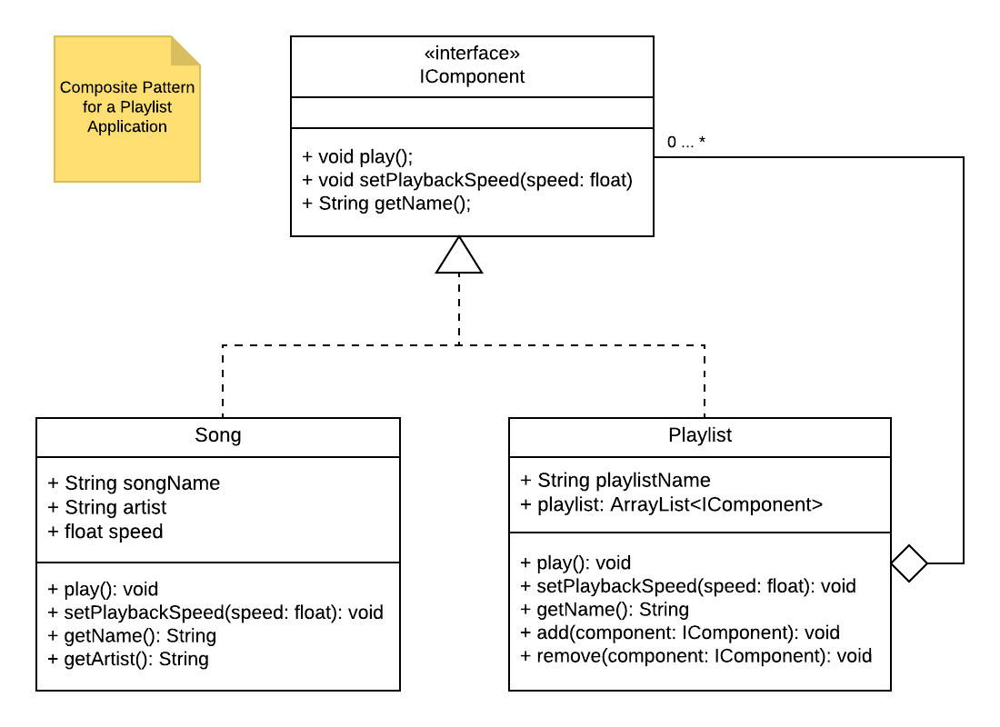

You have been asked to create a playlist application that will be used on Android devices (using the Java language). We will assume that each playlist can be composed of songs or other playlists, or a combination of both.

Your project manager has told you that the composite pattern is best used in this situation. The following UML class diagram that communicates the application’s objects and relationships using the composite pattern.

In this assignment you are required to complete the provided code. (Note: With the exception of the Playlist class, you do not need to actually implement the methods, just write filler comments (eg., // play song). With the Playlist class, write out the method to add songs to the playlist).

